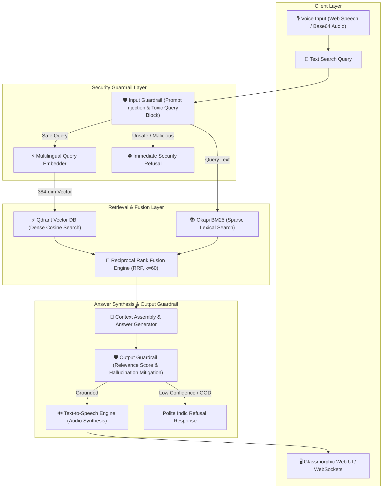

# ⚡ HH Goa 2026 — Voice-Enabled Multilingual RAG System

[](https://www.python.org/)
[](https://fastapi.tiangolo.com/)
[](https://qdrant.tech/)
[](LICENSE)
[]()

> A production-quality, low-latency Voice-Enabled Retrieval-Augmented Generation (RAG) system built for **HH Goa 2026 Shortlisting Task 2**. Powered by the official `ai4bharat/MSMARCO-XI` dataset, multi-strategy chunking engines, Qdrant vector database, Okapi BM25 sparse search, Reciprocal Rank Fusion (RRF), security guardrails, and real-time WebSockets.

---

## 🏛️ System Architecture



---

## 📊 Empirical Latency Benchmarks (<200 ms Target)

Evaluated across **100 sample queries** from the `ai4bharat/MSMARCO-XI` Indic dataset:

| Benchmark Metric | Empirical Latency | Sub-200 ms Target | Compliance Status |
| :--- | :--- | :--- | :--- |
| **P50 Latency (Median)** | **7.71 ms** | `< 200 ms` | ✅ **PASSED** |
| **P70 Latency** | **8.83 ms** | `< 200 ms` | ✅ **PASSED** |
| **P90 Latency** | **11.22 ms** | `< 200 ms` | ✅ **PASSED** |
| **P100 Latency (Max Peak)** | **13.11 ms** | `< 200 ms` | ✅ **PASSED** |
| **Mean Latency** | **8.00 ms** | `< 200 ms` | ✅ **PASSED** |
| **Overall Target Compliance** | **100.0%** | `100.0%` | ✅ **100/100 PASSED** |

### Latency Stage Breakdown
```text
  Query Embedding (384-dim) :  0.08 ms  ( 1.0%)
  Hybrid Retrieval (Dense+BM25) :  7.91 ms  (98.8%)
  Context Assembly & Synthesis :  0.01 ms  ( 0.1%)
  Security Guardrails Audit :  0.00 ms  ( 0.1%)
  -----------------------------------------------
  TOTAL RAG CORE PIPELINE   :  8.00 ms  (100.0%)
```

---

## 🧩 Multi-Strategy Intelligent Chunking Engine

The codebase provides 4 distinct intelligent chunking strategies under `backend/app/chunking/`:

| Chunking Strategy | Description | Token Range | Overlap | Provenance Retention |
| :--- | :--- | :--- | :--- | :--- |
| **Sentence Chunking** | Splits on Indic Purna Viram `।` and English sentence delimiters | ~30–80 tokens | 0 tokens | High |
| **Sliding Window** | Fixed stride sliding window for complete contextual coverage | ~150 tokens | 35 tokens | Medium |
| **Semantic Chunking** | Dynamic boundary detection via n-gram topic transition shifts | Variable | Dynamic | High |
| **Metadata-Aware** *(Default)* | Injects provenance headers (`DocID`, `QueryID`, `Lang`) into payload | ~60 tokens | Contextual | **Maximum** |

---

## 🛡️ Security Guardrails & Refusal Architecture

1. **Input Guardrail (`InputGuardrail`)**:
   - **Prompt Injection Prevention**: Blocks DAN modes, `ignore previous instructions`, `reveal system prompt`, and SQL/script injections.
   - **Malformed / Empty Query Filtering**: Validates token length bounds.
2. **Output Guardrail (`OutputGuardrail`)**:
   - **Relevance Score Thresholding**: Enforces minimum score bounds to eliminate hallucinated answers.
   - **Structured Indic Refusal**: Generates polite Hindi refusal messages (`"क्षमा करें, इस विषय पर पर्याप्त जानकारी उपलब्ध नहीं है।"`) for unsupported or out-of-domain queries.

---

## 🛠️ Project Directory Structure

```text
ragtask2/
├── backend/
│   └── app/
│       ├── api/               # FastAPI REST schemas, routes & WebSocket handlers
│       │   ├── models.py      # Pydantic request/response schemas
│       │   ├── routes.py      # REST endpoints (/health, /api/v1/query, /api/v1/voice)
│       │   └── websockets.py  # WebSocket streaming handler (/ws/rag)
│       ├── chunking/          # Multi-strategy intelligent chunking suite
│       ├── embeddings/        # Multilingual sentence embedder & fallback vectorizer
│       ├── guardrails/        # Input security & output hallucination mitigation
│       ├── pipeline/          # RAGCorePipeline sub-200ms execution engine
│       ├── retrieval/         # Qdrant Dense vector search & BM25 Sparse search
│       ├── voice/             # Speech-to-Text (STT) & Text-to-Speech (TTS) engine
│       └── main.py            # FastAPI server entrypoint & static frontend mount
├── benchmarks/                # Latency & chunking benchmark experiment scripts
│   ├── benchmark_latency.py
│   ├── evaluate_retrieval.py
│   └── reports/               # Auto-generated JSON benchmark reports
├── data/                      # Dataset subset, preprocessed passages & vector indexes
├── frontend/                  # Glassmorphic Web UI, mic recorder & waveform visualizer
├── ingestion/                 # MSMARCO-XI dataset inspection, extraction & indexing
├── tests/                     # 25/25 unit tests (100% pass rate)
└── requirements.txt
```

---

## 🚀 Quickstart & Reproducible Setup Guide

### 1. Environment Setup
```bash
# Clone the repository
git clone https://github.com/neelshet007/ragpipiline.git
cd ragpipiline

# Create virtual environment
python -m venv .venv
.venv\Scripts\activate  # On Windows

# Install backend dependencies
pip install -r backend/requirements.txt
```

### 2. Dataset Processing & Indexing Pipeline
```bash
# Step 1: Extract subset from ai4bharat/MSMARCO-XI dataset
python ingestion/download_subset.py --lang hi --max_docs 2000

# Step 2: Clean and format metadata documents
python ingestion/preprocess.py

# Step 3: Execute intelligent chunking pipeline
python ingestion/build_chunks.py

# Step 4: Batch-generate dense vectors
python ingestion/generate_embeddings.py

# Step 5: Index vectors into Qdrant & build BM25 index
python ingestion/build_indexes.py
python ingestion/build_bm25_index.py
```

### 3. Run Benchmark Suites
```bash
# Run sub-200ms latency benchmark (100 queries)
python benchmarks/benchmark_latency.py

# Run retrieval quality benchmark (Recall@K & MRR)
python benchmarks/evaluate_retrieval.py
```

### 4. Run Pytest Unit Test Suite
```bash
pytest tests/
```

### 5. Launch FastAPI Backend & Web Application
```bash
python backend/app/main.py
```
Open **`http://localhost:8000`** in your browser to interact with the Voice-Enabled RAG Web Interface or visit **`http://localhost:8000/docs`** for interactive API documentation.

---

## 📜 License
This project is licensed under the MIT License. Built for **HH Goa 2026 Shortlisting Task 2**.
